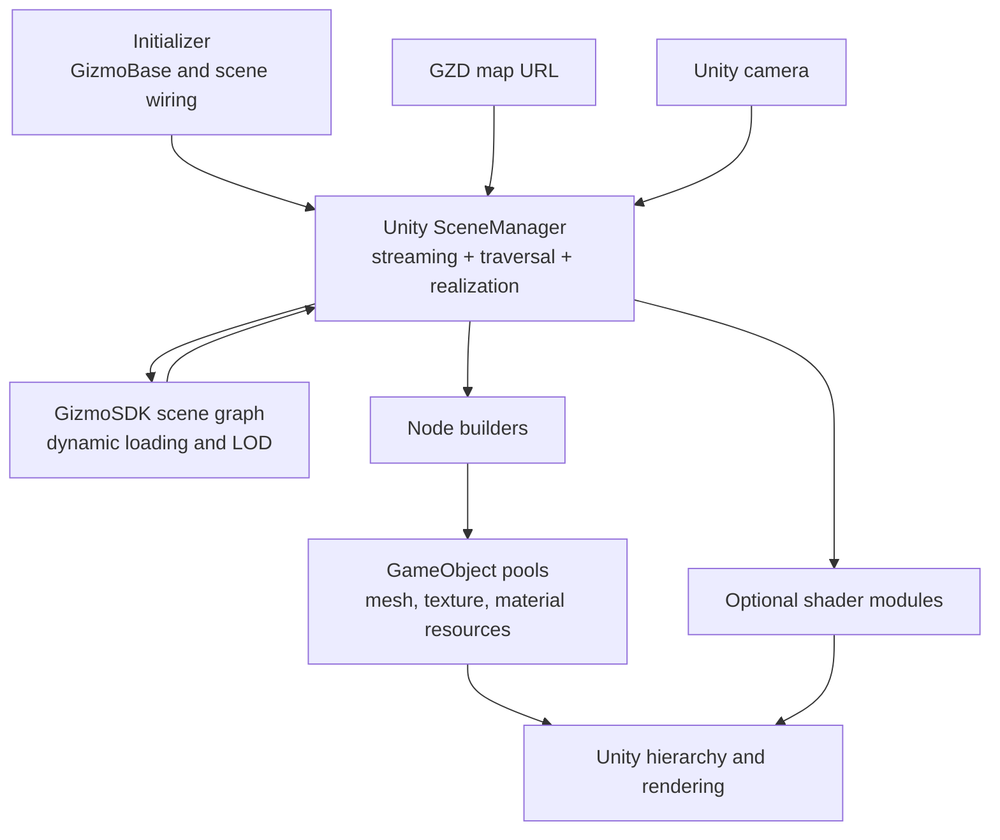

# Current architecture

**Status:** Existing implementation and migration baseline

## Purpose

This document records the architecture currently implemented in this
repository. It identifies proven patterns that should be retained and
responsibilities that move to the C# CSW SceneManager in the next generation.

The current architecture is not the target architecture. See
[Next-generation architecture](next-generation-architecture.md).

## Runtime composition

The current
[`SceneManager`](../../com.saab.map-streamer/Runtime/Saab.Foundation.Unity/Saab.Foundation.Unity.MapStreamer/SceneManager.cs)
is a Saab Unity implementation that combines:

- Gizmo3D scene, camera, context, traversal, and dynamic-loader ownership;
- direct GZD loading through `GizmoSDK.Gizmo3D.DbManager`;
- GizmoSDK scene traversal;
- Unity hierarchy creation and updates;
- node-builder selection and scheduling;
- Unity object pooling;
- texture and material resource management;
- frame traversal and camera synchronization; and
- map and native resource shutdown.

[`Initializer`](../../com.saab.map-streamer/Runtime/Saab.Unity/Saab.Unity.Initializer/Initializer.cs)
initializes GizmoBase, configures diagnostics and registries, locates the
`SceneManager` and camera control, and connects them before
`SceneManager.Start()` initializes streaming.

## Builder and factory pattern

[`INodeBuilder`](../../com.saab.map-streamer/Runtime/Saab.Foundation.Unity/Saab.Foundation.Unity.MapStreamer/NodeBuilder.cs)
defines the current realization contract:

- `CanBuild` selects a builder for a native GizmoSDK node and traversal state;
- `Build` realizes the node into a pooled `NodeHandle`;
- `InitPoolObject` decorates the pool prototype;
- `BuiltObjectReturnedToPool` releases or detaches resources;
- `Priority` selects immediate or deferred work; and
- texture and material managers are injected as shared services.

`SceneManager` registers builders before initialization and selects the first
builder whose `CanBuild` method succeeds. Deferred builds retain the
`NodeHandle` generation so stale work can be rejected after recycling.

The active geometry builders are:

- [`TerrainNodeBuilder`](../../com.saab.map-streamer/Runtime/Saab.Foundation.Unity/Saab.Foundation.Unity.MapStreamer/TerrainNodeBuilder.cs)
  for terrain geometry and terrain state;
- [`AssetNodeBuilder`](../../com.saab.map-streamer/Runtime/Saab.Foundation.Unity/Saab.Foundation.Unity.MapStreamer/AssetNodeBuilder.cs)
  for static asset geometry; and
- the internal
  [`AssetInstanceBuilder`](../../com.saab.map-streamer/Runtime/Saab.Foundation.Unity/Saab.Foundation.Unity.MapStreamer/AssetInstanceBuilder.cs)
  for sharing prefab mesh and material resources across GizmoSDK reference-node
  instances.

This is a builder/factory design even though selection and object allocation
are currently implemented directly by `SceneManager`.

## Pooling and resources

The implementation reduces runtime allocation through:

- a pool per `PoolObjectFeature`;
- builder-specific inactive GameObject prototypes;
- time-sliced background pre-allocation;
- deferred hierarchy release;
- generation checks that invalidate stale deferred builds;
- shared, reference-counted textures and materials;
- recycled `Texture2D` objects with a bounded cache; and
- reusable geometry conversion buffers.

[`TextureManager`](../../com.saab.map-streamer/Runtime/Saab.Foundation.Unity/Saab.Foundation.Unity.MapStreamer/TextureManager.cs)
and
[`MaterialManager`](../../com.saab.map-streamer/Runtime/Saab.Foundation.Unity/Saab.Foundation.Unity.MapStreamer/MaterialManager.cs)
are owned by `SceneManager` and shared by builders.

## Optional shader and GPU modules

The active example scene demonstrates optional modules attached beside the
core `SceneManager`:

- `MapShadingModule` adds classified terrain detail textures and normals
  through texture arrays and a feature mapping buffer.
- `FoliageModule` generates and culls foliage on the GPU and renders it with
  indirect procedural draws.
- `CameraShaderUpdater` supplies camera-relative shader offset and Local Tangent
  Frame basis
  values required by shaders.

The modules subscribe to `SceneManager` events such as `OnNewTerrain`,
`OnRemoveTerrain`, and `OnPostTraverse`. Their activation currently combines
Inspector state, `GfxCaps` flags, `KeyDatabase` settings, materials,
ScriptableObject asset sets, shaders, and compute shaders.

This proves that shader functionality can be layered on top of streamed
terrain, but the activation and dependency contract is not yet a formal module
API.

## Patterns to retain

- Builder/factory separation between scene interpretation and Unity resource
  creation.
- Immediate and deferred realization with stale-work detection.
- Pooling and reference-counted resource reuse.
- Asset-instance sharing.
- Optional shader functionality connected through lifecycle events.
- GPU-driven terrain and foliage processing.
- Camera-relative shader data for large geospatial coordinates.
- Explicit time budgets and profiler markers.

## Responsibilities to move or separate

- Gizmo scene ownership, map lifecycle, traversal, dynamic loading, and frame
  production move to C# CSW SceneManager.
- Unity realization consumes typed CSW buffers instead of traversing the
  mutable native scene directly.
- Runtime composition uses explicit references and configuration assets rather
  than scene-wide `FindObjectOfType` calls.
- Builder registration, feature activation, fallback behavior, and capability
  reporting become formal contracts.
- Optional shader modules no longer depend on unrelated global capability
  state.
- Thread transfer, buffer ownership, queue bounds, and frame commit become
  explicit.

## Known migration considerations

- Existing builders accept `GizmoSDK.Gizmo3D.Node` and `NodeHandle`; target
  builders need a format-neutral scene payload and a stable instance identity.
- The current `SceneManager` owns both streaming and pools. The target splits
  those lifetimes between CSW SceneManager and CSWUnity realization services.
- Current resource caches are valuable but need content-stable keys,
  measurable limits, and a documented lease model.
- Current terrain and foliage modules depend on specific shader properties and
  event timing; adapters or revised module contracts are required.
- Legacy crossboard and standalone culling components should not define the
  target architecture unless a supported feature still depends on them.
