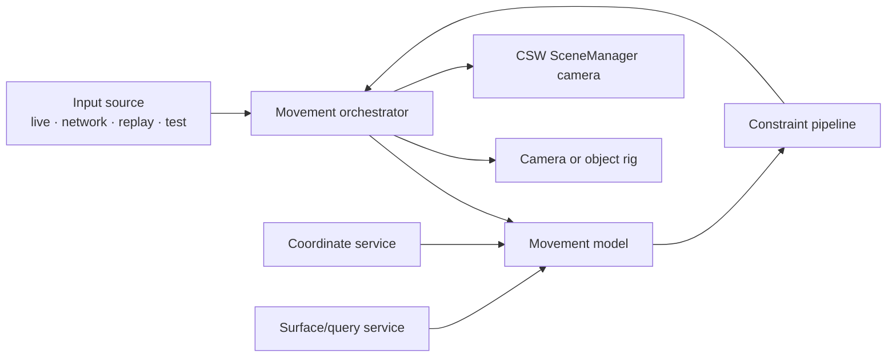

# Movement model architecture

**Status:** Proposed target architecture

## Context

The current camera implementations combine Unity input, camera pose,
coordinate conversion, map intersection, movement rules, and shader updates.
The next generation separates these responsibilities so movement can be
configured, replayed, tested, and reused.

The initial model set is:

- free flight;
- geodetic orbit and map navigation; and
- ground-following flying carpet.

## Architecture

## Contracts

### Input source

An input source produces an immutable semantic input frame:

- translation axes or displacement request;
- look or orbit delta;
- zoom request;
- speed modifier;
- action requests;
- source time and sequence; and
- input-source identity.

Movement models never read Unity input APIs directly.

### Movement state

Movement state contains:

- double-precision authoritative position;
- orientation relative to a declared local basis;
- optional focus position;
- distance, linear velocity, and angular velocity;
- active model and transition;
- coordinate-context and origin generation; and
- latest valid surface sample.

### Movement model

A movement model advances state from:

- previous movement state;
- semantic input;
- explicit time step;
- coordinate context;
- available surface/query snapshots; and
- its serialized parameter profile.

It produces desired state and diagnostics. It does not mutate a Unity
Transform.

### Constraint pipeline

Constraints evaluate desired movement in a deterministic order. Examples
include:

- minimum and maximum distance;
- surface clearance;
- collision or exclusion volumes;
- geographic bounds;
- slope;
- speed and acceleration;
- heading, pitch, and roll; and
- product-provided policies.

A result contains accepted state, correction, active constraints, and an
outcome.

### Rig

A rig owns the Unity camera or controlled Unity object. It applies accepted
state through the coordinate service and exposes viewport/projection
information. It contains no map navigation policy.

### Orchestrator

The orchestrator:

1. samples input on the Unity main thread;
2. advances transitions and the selected model using world time;
3. resolves completed asynchronous query samples;
4. applies constraints;
5. commits the accepted pose to the rig;
6. publishes the converted camera snapshot to CSW SceneManager; and
7. publishes observable movement state.

Each state step occurs once. Unity `Update`, `LateUpdate`, and SceneManager
refresh hooks shall not advance the same model independently.

## Free-flight model

Free flight supports configurable translation and rotation in three
dimensions.

Its profile defines:

- local or world translation frame;
- whether yaw uses local map up;
- roll policy;
- speed range and modifiers;
- acceleration, deceleration, and damping;
- pitch limits; and
- optional constraints.

The default direct profile stops when input ends. An inertial profile can
continue explicitly.

## Geodetic orbit and map navigation

This model maintains a focus on the map and supports:

- projected-map panning;
- ellipsoid-aware spherical panning;
- anchor-preserving zoom;
- focus orbit;
- local-north reset;
- map and arbitrary-bounds fitting; and
- semantic look-at, move-to, and fly-to requests.

Local east, north, and up are evaluated at the relevant focus or camera
position. Long spherical transitions follow a continuous valid path around the
ellipsoid.

## Flying-carpet model

Flying carpet is a ground-following movement model, not an existing behavior
being copied.

### State

- horizontal motion intent;
- target and minimum clearance;
- vertical response velocity;
- last accepted surface position, normal, quality, and time;
- local up and optional surface-alignment blend; and
- unavailable-data state.

### Update flow

1. Advance horizontal intent in the active map frame.
2. Predict the query position for the next state.
3. Submit or reuse an asynchronous surface query.
4. If a valid sample is available, calculate target altitude and optional
   orientation.
5. Apply vertical smoothing, speed, acceleration, pitch, roll, and clearance
   constraints.
6. If no valid sample is available, apply the configured fallback.
7. Commit the accepted pose and submit the camera snapshot.

### Surface fallback policies

- **Hold:** retain the last valid ground-relative height within an expiry.
- **Limited inertial:** continue for a bounded time or distance.
- **Safe climb:** move toward a configured absolute or relative safe height.
- **Stop:** stop horizontal and vertical movement at the last valid pose.

The profile selects one policy. No policy performs a blocking wait for streamed
terrain.

## Semantic actions

Discrete actions use a common request model:

- action and target;
- immediate or animated transition;
- duration/easing profile;
- active constraint profile;
- correlation identity; and
- cancellation.

Outcomes are completed, cancelled, unavailable, or failed. Manual input or a
newer exclusive request can cancel an active transition while preserving the
current valid pose.

## Target tracking

Tracking consumes an object or position provider rather than holding a Unity
Transform as the authoritative target.

Supported strategies include:

- focus tracking with preserved view parameters;
- smoothed follow;
- target-relative attached follow; and
- optional return-to-home after target loss.

Tracking stops deterministically when the target disappears, becomes stale, or
cannot be followed within active constraints.

## Threading

- Input sampling and Unity rig application occur on the Unity main thread.
- Coordinate calculations and movement-model evaluation may run outside the
  main thread when they use immutable data and thread-safe GizmoSDK services.
- Surface queries are asynchronous CSW SceneManager operations.
- Query completion is applied by correlation identity and movement generation.
- Late results from a cancelled action, old map, or old origin are discarded.

## Diagnostics

The movement service exposes:

- current model and profile;
- authoritative pose and focus;
- latest input and query age;
- transition and tracking state;
- active constraints and corrections;
- surface clearance and fallback state;
- coordinate/origin generation; and
- movement and query processing time.

## Migration

- `CameraControlBase` becomes a rig/SceneManager camera adapter.
- Direct input in `CameraControl` and `CameraInputHandler` moves to input
  adapters.
- Free-flight behavior moves to `FreeFlightModel`.
- map pan, orbit, and zoom behavior in `GeodeticCameraControl` moves to the
  geodetic navigation model.
- Direct synchronous map queries move to the asynchronous query service.
- `CameraShaderUpdater` moves to the shared coordinate/render service.

## Related documentation

- [Camera and movement use cases](../requirements/camera-use-cases.md)
- [Movement requirements](../requirements/movement-models.md)
- [Scene control and threaded realization](scene-control-and-threading.md)
