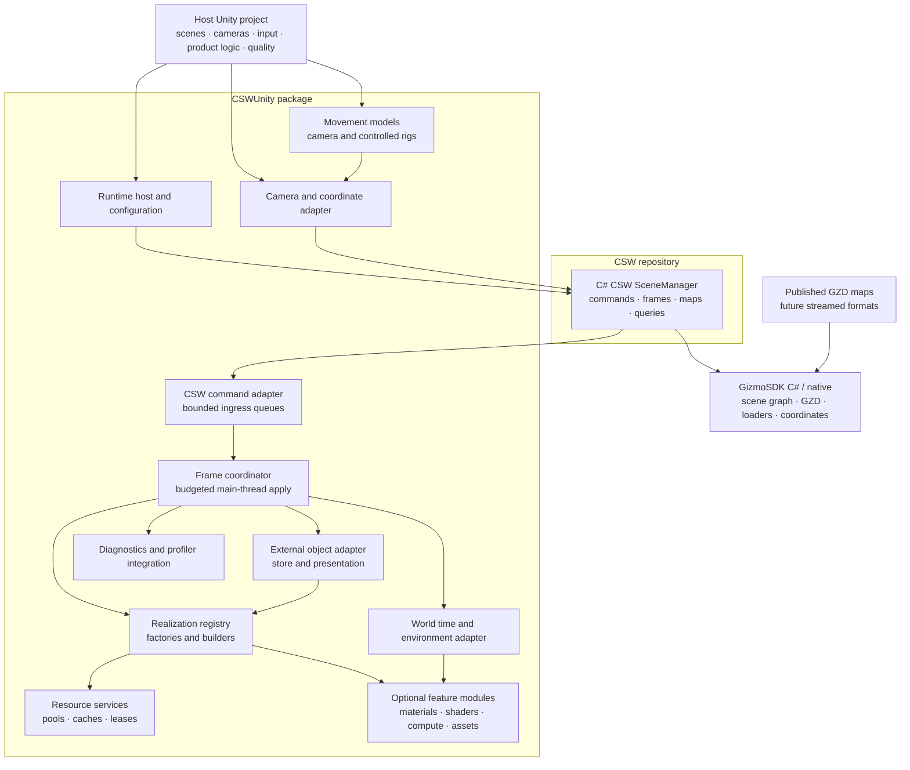
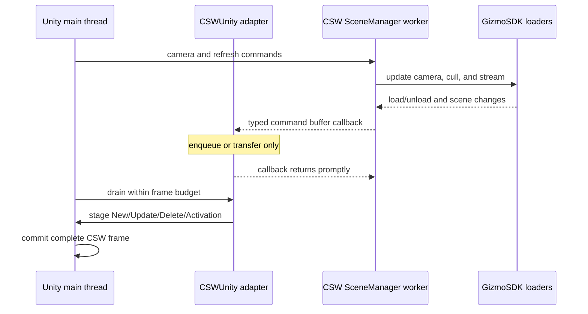
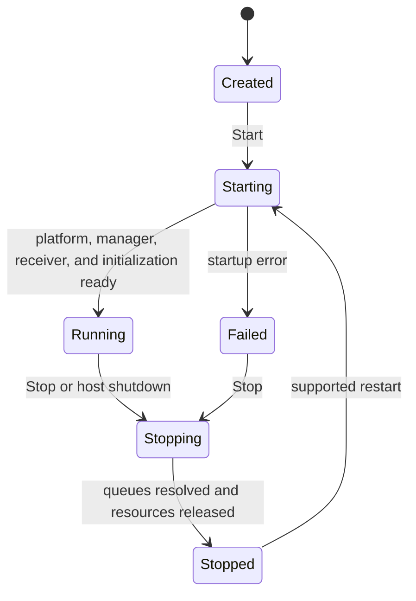

# Next-generation architecture

**Status:** Proposed target architecture

## Context

The next generation of CSWUnity shall follow the same separation used by the
C++ CSW SceneManager and CSWUnreal:

1. an engine-neutral CSW SceneManager owns streaming and emits typed commands;
2. an engine-specific adapter receives those commands; and
3. engine-specific factories realize scene content under the engine's
   threading and resource rules.

For Unity, the reusable core is the
[C# CSW SceneManager](https://saab.ghe.com/saab/CSW/tree/main/source/Presentation/Streaming/C%23).
The
[C++ SceneManager and CSWUnreal](https://saab.ghe.com/saab/CSW/tree/main/source/Presentation/Streaming)
are the behavioral reference.

The current C# API does not yet expose every output command required by a full
engine realization. Completing the managed structural, frame, geographic,
error, and query contract is a prerequisite for replacing the current Unity
`SceneManager`.

## Goals

- Provide reusable Unity components and assets for arbitrary host projects.
- Keep CSW SceneManager independent of Unity.
- Preserve CSWUnreal command, frame, coordinate, and lifecycle principles.
- Support GZD first without making Unity realization GZD-specific.
- Sustain high streaming throughput with bounded main-thread work.
- Retain proven builder, pooling, resource-sharing, and optional shader
  patterns.
- Integrate external world objects through a transport-neutral object model.
- Realize CSW world time and environment capabilities through optional Unity
  modules.
- Provide interchangeable camera and movement models.

## Non-goals

- Generate maps or source assets.
- Move product-specific input, UI, or simulation behavior into CSWUnity.
- Copy Unreal component types, material conventions, or C++ ownership into C#.
- Allow background workers to invoke unrestricted Unity APIs.

## Layered architecture



## Responsibility boundaries

| Layer | Responsibilities |
| --- | --- |
| Host project | Unity scenes, camera selection, input, product lifecycle, render-pipeline choice, deployment, and quality profile |
| CSWUnity runtime host | Configuration, lifecycle state, dependency validation, and coordination |
| CSW command adapter | Receiver registration, bounded transfer, buffer decoding or leasing, ordering, and ownership |
| Frame coordinator | Main-thread scheduling, frame staging/commit, hierarchy ordering, and budgets |
| Realization registry | Deterministic factory selection and feature fallback |
| Builders/realizers | Create, update, activate, deactivate, and release Unity representations |
| Resource services | Object, mesh, texture, material, and instance pooling/caching with explicit ownership |
| Object integration | Transport-neutral object state, motion presentation, and Unity presenters |
| World/environment integration | World time and semantic environment snapshots |
| Movement services | Input-independent movement models, constraints, queries, and camera/object rigs |
| Optional modules | Render-pipeline-specific weather, shaders, GPU features, foliage, terrain detail, and sensors |
| C# CSW SceneManager | Map and ROI lifecycle, scene traversal, dynamic loading, camera/frame commands, queries, and typed output buffers |
| GizmoSDK | GZD and other supported readers, native scene graph, coordinate services, serialization adapters, and low-level loading |

## Command and thread model

Detailed map, coordinate, position, intersection, asset, and scene-update
control is defined in
[Scene control and threaded realization](scene-control-and-threading.md).



The receiver callback must not build meshes, materials, textures, or
GameObjects. It transfers a bounded amount of data and returns so that CSW
SceneManager is not blocked by Unity work.

When a CSW buffer contains mutable native references, CSWUnity must either:

1. copy the required format-neutral data while holding the documented lock;
2. acquire an explicit payload lease valid beyond the lock; or
3. schedule a supported native-to-Unity upload path with equivalent ownership.

Raw pointers and unlocked mutable scene nodes must not become queued Unity
work items.

## Scene protocol

The managed CSW SceneManager contract must provide:

| Category | Required semantics |
| --- | --- |
| Lifecycle | Initialize, uninitialize, completion, and failure |
| Maps | Set, add, remove, clear, source identity, and correlated result |
| Geographic context | Coordinate system, origin, units, and map compatibility |
| Structure | New, update, and delete with node and parent identity |
| Visibility | Activation and deactivation, including LOD transitions |
| Frames | Start and end boundaries with ordering |
| Camera | Position, orientation, projection, viewport, LOD factor, and render time |
| Queries | Correlated intersection, ground-clamp, and position responses as enabled |
| Diagnostics | Typed severity, error code, message, source, and correlation ID |

Scene instances use a compound identity. A path ID alone is insufficient
because CSW SceneManager can recycle ROI/path identifiers after deletion. The
Unity key therefore includes stream/source identity and a generation or
equivalent lifetime token.

## Frame staging and commit

CSWUnity stages structural changes until the corresponding end-of-frame
boundary is available. It then applies them in dependency order:

1. release deletes that must precede identity reuse;
2. create parents before children;
3. apply state and resource updates;
4. apply activation changes; and
5. notify optional modules after the hierarchy is internally consistent.

Large resource builds may span Unity frames, but logical ordering remains
stable. Placeholder or inactive representations may be used while a resource
is pending. A stale generation invalidates pending work before it allocates or
publishes resources.

## Realization registry and builders

The current `INodeBuilder` pattern evolves into a format-neutral realization
contract.

A registry entry declares:

- supported scene payload type and required state;
- produced Unity representation type;
- required render-pipeline or hardware capabilities;
- cost/priority classification;
- fallback behavior; and
- optional feature dependencies.

A realizer supports:

- **Create:** allocate or obtain a pooled representation;
- **Update:** modify supported state without unnecessary replacement;
- **SetActive:** handle visibility and LOD activation;
- **Release:** return resources and objects to their owners; and
- **Reset:** clear map- or session-scoped caches.

Registration occurs before the runtime enters `Running`. Duplicate selectors
or unsupported required payloads fail validation explicitly.

## Resource architecture

Resource services are independent from individual builders:

- GameObject/component pools are keyed by representation class.
- Mesh resources are keyed by stable content or source identity and layout.
- Texture resources are keyed by content/source identity, dimensions, format,
  mip state, and color-space semantics.
- Materials are keyed by shader/profile and immutable render state.
- Shared assets and instances hold explicit leases or reference counts.
- Cache budgets and eviction are configurable and observable.

Unity object creation and destruction occurs on the main thread. CPU decoding
or conversion may use workers, jobs, Burst, and reusable native memory when
the selected Unity version supports the path.

## Optional shader and feature modules

Optional rendering is configured through feature profiles and serialized
assets rather than hidden global state.

The target extension points cover:

- post-create and pre-release notifications;
- resource decoration or substitution;
- post-frame GPU dispatch and drawing;
- camera/origin shader parameters;
- capability and render-pipeline validation; and
- per-feature diagnostics and budgets.

The current terrain detail, GPU foliage, and camera shader updater are
migration candidates:

| Current feature | Target placement |
| --- | --- |
| `MapShadingModule` | Optional terrain-shading feature and profile |
| `FoliageModule` | Optional GPU foliage feature with explicit compute/shader dependencies |
| `CameraShaderUpdater` | Coordinate/render service shared by interested features |
| `GfxCaps` flags | Capability report plus explicit feature-profile selection |
| Terrain/Foliage ScriptableObjects | Versioned feature assets |

The common streaming package must remain usable when none of these modules is
installed.

## Source-format evolution

CSWUnity consumes a common scene protocol, not a GZD object model. GZD remains
the first production source and is loaded by GizmoSDK through CSW SceneManager.

Support for another streamed format may require changes in GizmoSDK or CSW
SceneManager, but it must not require changes to:

- CSWUnity lifecycle;
- command ingress and frame scheduling;
- stable instance identity;
- coordinate adaptation; or
- builders whose supported common payloads are unchanged.

Format-specific metadata may be exposed as optional typed extensions without
becoming mandatory for common builders.

## Package shape

The initial delivery may use one Unity package, but its assemblies and folders
must preserve boundaries that allow later package separation:

```text
Runtime/
  Core/             lifecycle, configuration, command adapter, frame scheduler
  Realization/      registry, builders, identities, resource services
  Coordinates/      camera, origin, and geographic adaptation
  Objects/          external object store, motion, and Unity presenters
  World/            time and environment contracts
  Movement/         input, movement models, constraints, and rigs
  Diagnostics/      logs, counters, and profiler markers
  Features/         optional feature integrations
Editor/             inspectors, validation, and authoring tools
Tests/
Samples~/
Shaders/
Resources or assets required by installed features
```

The final package identifier and optional package split remain design
decisions. Consumers depend only on public assemblies and serialized assets,
not the repository example project.

## Lifecycle



Shutdown order is:

1. stop new host submissions;
2. cancel or drain pending Unity realization work;
3. release realized Unity resources and feature modules;
4. detach the command receiver;
5. stop and dispose CSW SceneManager;
6. release the GizmoSDK platform reference; and
7. publish the final `Stopped` or `Failed` state.

## Performance strategy

- Keep CSW loading and traversal off the Unity main thread.
- Bound every cross-thread queue and define overload behavior.
- Decode or lease buffers with minimal lock duration.
- Apply Unity changes under configurable time and item budgets.
- Pre-size and reuse command, instance, hierarchy, and resource storage.
- Avoid ordinary steady-state managed allocations after warm-up.
- Share immutable resources and use instancing or batching where appropriate.
- Cancel work by instance generation before performing expensive conversion.
- Instrument every queue and processing stage.

Performance approval uses a published release profile rather than an
unrepeatable statement that the system is "fast".

## Migration sequence

1. Complete the C# wrappers for CSW structural, frame, geographic, error, and
   correlated response commands.
2. Build a headless managed contract test against the C# CSW SceneManager.
3. Add the CSWUnity command adapter, stable identity, and frame coordinator
   without Unity resource creation.
4. Port basic node/transform and geometry realization behind the new registry.
5. Add pooling and shared mesh, texture, material, and instance services.
6. Port camera and coordinate behavior and validate against CSWUnreal.
7. Add movement-model and asynchronous spatial-query services.
8. Add the transport-neutral external object store and Unity presenters.
9. Add world-time and environment contracts.
10. Port terrain detail and foliage and add environment realizations as
   optional modules.
11. Establish performance profiles and optimize measured bottlenecks.
12. Deprecate the current Unity-owned streaming `SceneManager` after feature and
   performance parity.

## Open decisions

- Managed payload representation: copied DTOs, leased native payloads, or a
  hybrid.
- Supported Unity versions, platforms, and render pipelines.
- Numeric release performance profiles.
- Package and assembly split for optional rendering features.
- Required initial query set beyond map, camera, and frame streaming.
- Initial environment contract fields and authoritative providers.
- Initial external-object schemas and transport adapters.

## Related documentation

- [Next-generation architecture requirements](../requirements/next-generation-architecture.md)
- [Scene control requirements](../requirements/scene-control.md)
- [Scene control and threaded realization](scene-control-and-threading.md)
- [Synthetic world](synthetic-world.md)
- [External object integration](object-integration.md)
- [Movement models](movement-models.md)
- [Rendering](rendering.md)
- [Current architecture](current-architecture.md)
- [Streaming Map pipeline](streaming-map-pipeline.md)
- [Runtime initialization](runtime-initialization.md)
