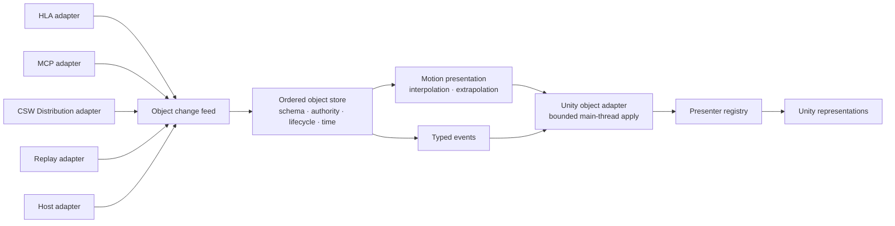
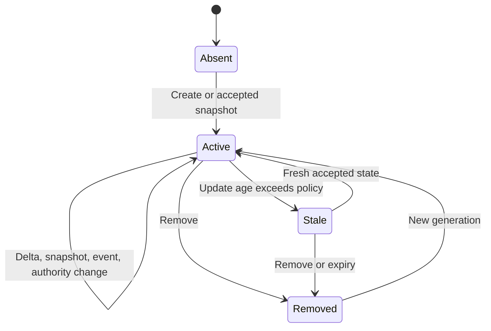

# External object integration architecture

**Status:** Proposed target architecture

## Context

CSWUnity needs a stable object boundary so projects can connect external
systems without coupling transports to Unity GameObjects or coupling Unity
presenters to HLA, MCP, CSW Distribution, future DIS support, or
product-specific protocols.

The architecture normalizes updates into an engine-neutral object model before
they enter Unity.

## Architecture

## Normalized object model

### Identity

An object identity contains a namespace and value. The namespace prevents
collisions between independent external systems. Transport handles and Unity
instance IDs remain adapter details.

### Type and schema

A type identity contains schema family, type name, and version. Its schema
defines:

- attributes and data types;
- units and coordinate frames;
- required and optional values;
- default and missing-value semantics;
- event payloads; and
- compatibility rules.

CSW/GizmoSDK dynamic values can represent flexible attributes, but every public
attribute still needs declared semantics.

### Change envelope

Every normalized change contains:

- object identity and type;
- lifecycle operation;
- source and adapter identity;
- source sequence or revision;
- correlation identity;
- source, simulation, receive, and optional expiry time;
- coordinate context;
- authority information; and
- typed snapshot, delta, or event payload.

The change is immutable after entering the object feed.

## Object lifecycle

The object store applies these operations:

A recreated identity receives a new generation so delayed updates from the
previous lifetime cannot affect it.

## Ordering and authority

The object store performs, in order:

1. schema validation;
2. identity and generation resolution;
3. source authority validation;
4. duplicate and revision checks;
5. bounded out-of-order handling;
6. lifecycle transition;
7. snapshot or delta application; and
8. publication of approved immutable state.

Authority can apply to a whole object or attribute group. A transport
connection alone does not imply ownership.

## Time and motion

Object state retains source time separately from receive and presentation time.
A motion service consumes approved timestamped snapshots and provides a
presentation pose.

Policies include:

- interpolation with configurable render delay;
- bounded extrapolation when velocity or acceleration is available;
- stale timeout;
- correction smoothing for late authoritative updates; and
- teleport or discontinuity handling.

The motion service uses the common coordinate service and world clock. It is
independent of transport and Unity presentation.

## Transport adapters

An adapter owns:

- connection and session lifecycle;
- transport identity mapping;
- schema/type mapping;
- encoding and decoding;
- source time and sequence extraction;
- authority mapping;
- bounded ingress and overflow behavior;
- reconnect and snapshot recovery; and
- transport-specific diagnostics.

HLA FOM mappings, MCP dynamic properties, and CSW Distribution types map into
the same normalized model. Future DIS or host protocols add adapters rather
than new presenter contracts.

## Unity adapter and presenters

The Unity adapter receives approved object-store changes and queues bounded
main-thread work. A presenter registry selects a presenter from object schema
and capability declarations.

A presenter may:

- allocate or reuse a Unity representation;
- bind shared map or model assets;
- apply snapshot and delta state;
- apply the interpolated presentation pose;
- handle typed events;
- expose semantic selection or interaction metadata to the host;
- represent stale or degraded state; and
- release resources on removal.

Presenters do not open network connections and do not interpret
transport-specific payloads.

## Relationship to streamed maps

Map scene instances and external objects use different lifecycle sources but
share:

- world/session identity;
- coordinate conversion;
- Local 3D Frame identity and generation;
- world time;
- resource services where appropriate;
- optional environment state; and
- committed frame notifications.

An external object may reference a streamed map asset by stable asset identity.
The presenter resolves that reference through an asset service rather than
assuming a Unity prefab path.

## Threading and backpressure

1. Transport callbacks decode and enqueue immutable changes.
2. A source-specific bounded queue applies overflow policy.
3. One ordered dispatcher updates the object store.
4. Motion preparation may execute outside the Unity main thread.
5. The Unity adapter applies approved changes under a frame budget.

Queue overload never causes unbounded memory growth. Policies may coalesce
replaceable state updates but must not drop create, remove, authority, or
non-replaceable event semantics silently.

## Diagnostics

Metrics include:

- connection and source state;
- ingress and reorder queue depth;
- accepted, duplicate, stale, rejected, dropped, and resynchronized changes;
- schema and authority failures;
- source-to-store and store-to-visible latency;
- interpolated, extrapolated, stale, and corrected objects; and
- active presenters and resource leases.

## Related documentation

- [External object requirements](../requirements/object-integration.md)
- [Synthetic world architecture](synthetic-world.md)
- [Rendering architecture](rendering.md)
