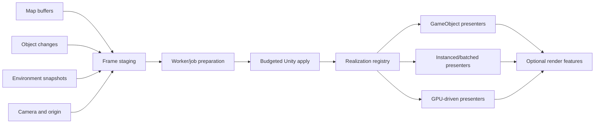

# Rendering architecture

**Status:** Proposed target architecture

## Context

CSWUnity must present several coordinated streams efficiently:

- streamed map scene changes from C# CSW SceneManager;
- externally updated world objects;
- world time and environment state;
- camera and local-origin changes; and
- optional synthetic-world rendering features.

The architecture separates semantic state, CPU preparation, Unity publication,
and GPU realization.

## Rendering pipeline

## Coherent presentation state

Every visible change is associated with:

- world time or presentation time;
- coordinate context;
- local-origin generation;
- source and object/map generation; and
- scene or object-store revision.

Map changes use CSW frame boundaries. External objects and environment updates
are sampled for the same presentation time and applied before feature modules
receive the committed-frame notification.

This does not require all streams to update at the same frequency. It requires
their sampled state and validity to be explicit.

## Realization strategies

### Semantic GameObjects

Use GameObjects/components when content needs host interaction, independent
behavior, physics, semantic lookup, or ordinary Unity tooling.

### Shared asset instances

Use shared meshes, textures, and materials with independent transforms and
activation for repeated map or world assets.

### Instanced or batched content

Use renderer-appropriate instancing, batching, or data-oriented storage for
large groups of compatible objects that do not need independent GameObjects.

### GPU-driven content

Use compute preparation, culling, and indirect drawing for dense features such
as foliage when required by the performance profile.

A realization profile chooses strategies through capability declarations.
The core SceneManager adapter does not hard-code one representation.

## Preparation and publication

### Worker/job preparation

Candidate work includes:

- extracting or copying leased scene payloads;
- converting coordinate, vertex, normal, color, and UV data;
- generating indices, tangents, bounds, and hashes;
- preparing texture data;
- resolving hierarchy dependencies;
- coalescing replaceable updates; and
- preparing instance and batch data.

### Unity apply

Unity publication:

- creates or reuses objects and components;
- commits hierarchy and transforms;
- publishes mesh and texture data through supported APIs;
- resolves materials and shaders;
- updates renderer state;
- applies activation;
- releases stale resources; and
- notifies feature modules after coherent commit.

The implementation shall verify which publication APIs may be scheduled
through jobs for each supported Unity version. Unsupported worker-thread Unity
access is prohibited.

## Resource graph

Resource ownership is represented as a graph rather than implicit references:

- a scene instance leases a representation;
- representations lease meshes, textures, materials, and source assets;
- shared resources use stable content/source keys;
- cache entries record size, users, last use, and eviction state;
- pending builds hold cancellable generation-bound reservations; and
- map/object deletion releases only the leases owned by that generation.

Cache limits are defined by the resource profile and enforced independently for
CPU and GPU memory where measurable.

## Culling and LOD

GizmoSDK and CSW SceneManager own source streaming and map LOD decisions.
CSWUnity additionally applies Unity/render-pipeline culling and representation
selection.

The two layers must not fight:

- CSW activation controls whether a streamed instance is semantically active;
- Unity culling controls whether an active representation is submitted for
  rendering;
- optional dense-feature modules may perform additional GPU culling; and
- a quality profile controls compatible thresholds and budgets.

## Environment rendering

Environment modules consume the common environment snapshot:

| Semantic state | Example Unity realization |
| --- | --- |
| Time, sun, moon, ambient | Sky and lighting adapter |
| Visibility/extinction | Fog or atmospheric scattering |
| Clouds | Pipeline-specific cloud system |
| Precipitation | Rain/snow particles and surface response |
| Wind | Vegetation, particles, water, and audio parameters |
| Water/sea state | Water renderer and wave parameters |
| Surface condition | Terrain material wetness, snow, or dust |
| Sensor environment | Modality-specific post-process or render pass |

Modules declare whether behavior is physically meaningful, a visual
approximation, or both.

## Shader and feature contract

A feature module declares:

- semantic inputs;
- required realization events;
- materials, shaders, compute kernels, and assets;
- render-pipeline and hardware requirements;
- quality parameters;
- CPU, GPU, and memory budgets;
- fallback or disable policy; and
- diagnostics.

Camera-relative world offsets and local coordinate bases come from one shared
coordinate/render service rather than independent shader scripts.

## Quality profiles

A quality profile selects:

- source loaders and LOD factor;
- representation strategies;
- main-thread and worker budgets;
- mesh and texture quality;
- shadows and lighting;
- dense-feature density and distance;
- environment and sensor effects;
- cache limits; and
- overload/degradation policies.

Profiles are data assets and can be overridden by the host at runtime through a
documented API.

## Performance validation

A repeatable scenario includes:

- versioned maps and object/environment recordings;
- deterministic camera and origin path;
- target hardware, operating system, Unity version, and render pipeline;
- warm-up and measurement intervals; and
- expected visible-state checkpoints.

Measured values include:

- Unity main-thread and render-thread time;
- worker/job time;
- GPU time;
- source-to-visible latency;
- queue depth and buffer wait;
- active, culled, prepared, published, and stale items;
- draw calls, batches, instances, and triangles;
- CPU/GPU mesh and texture memory;
- cache hit, miss, and eviction;
- upload volume; and
- managed allocation.

Correctness gates run before performance comparison. A faster result that
violates identity, ordering, coordinates, or resource lifetime fails.

## Degradation

When budgets or capabilities are exceeded, the system follows explicit policy:

- reduce optional density or effect quality;
- delay low-priority realization within latency bounds;
- prefer shared or instanced representations;
- disable an unsupported optional module;
- reject additional work with diagnostics; or
- request a lower source quality where supported.

Core map lifecycle, object identity, and required query behavior are not
silently discarded.

## Related documentation

- [Rendering requirements](../requirements/rendering.md)
- [Synthetic world architecture](synthetic-world.md)
- [External object integration](object-integration.md)
- [Scene control and threaded realization](scene-control-and-threading.md)
