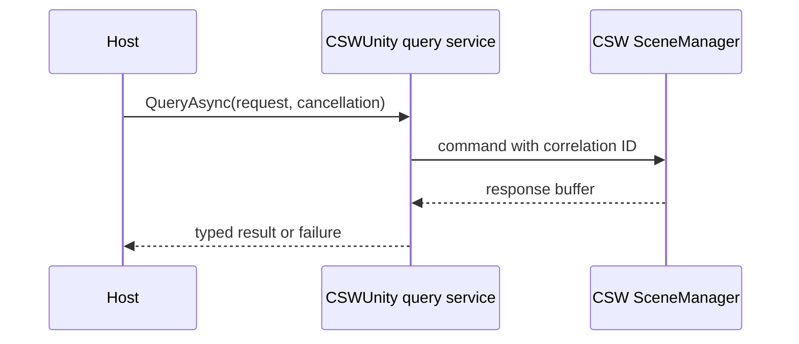
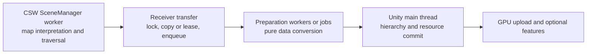

# Scene control and threaded realization

**Status:** Proposed design and feasibility plan

## Context

The next-generation C# CSW SceneManager interprets map content through
GizmoSDK and emits buffer-based changes. CSWUnity converts those changes into
Unity geometry, resources, hierarchy updates, activation changes, and feature
events.

CSWUnreal proves the architectural separation:

- C++ CSW SceneManager processes commands and produces typed buffers on its
  worker thread.
- The Unreal receiver queues buffers and returns promptly.
- Unreal consumes bounded work during Tick.
- Factories build, update, and destroy engine representations.
- Coordinate and query services remain available through the engine adapter.

The same separation is applicable to Unity. The amount of geometry and
resource work that can execute outside the Unity main thread must be proven
against the selected Unity versions and APIs.

## Current managed API gap

The C# CSW SceneManager currently wraps several input controls:

- initialize and uninitialize;
- set and add map URLs and clear maps;
- camera position and refresh;
- loader count and texture pre-cache;
- LOD factor and omnidirectional traversal;
- render time, error messages, and map centering.

It does not yet expose the complete managed output surface required by
CSWUnity. Before production integration, C# wrappers and factories are needed
for at least:

- `GeoInfo`;
- `StartFrame` and `EndFrame`;
- `NewNode`, `UpdateNode`, and `DeleteNode`;
- `Activation`;
- camera-position request and response;
- ray intersection request and response;
- ground-clamp request and response; and
- complete map-operation results, including remove and failure correlation.

This wrapper completion is the first feasibility gate.

## Control model

CSWUnity provides three API levels over the same runtime:

| Level | Intended user | Surface |
| --- | --- | --- |
| Component | Typical host project | Unity components, serialized profiles, events, and status |
| Service | Product integration | Typed map, coordinate, position, query, asset, and scene services |
| Extension | Feature and renderer developers | Realization registry, frame hooks, typed payloads, and controlled low-level commands |

The component API delegates to services. Services create correlated CSW
commands and interpret results. Extensions cannot bypass ownership, ordering,
or thread-affinity rules.

## Functional control surfaces

### Map control

The map service translates typed operations into CSW SceneManager commands:

- set the complete map set;
- add a map;
- replace a map;
- remove one map;
- clear all maps;
- configure loader and LOD behavior; and
- inspect source status and map metadata.

The service tracks operations by correlation identity rather than assuming
that command submission means completion.

### Coordinate control

`GeoInfo` establishes the coordinate-system descriptor and Map Origin
`GeoPosition`, or explicitly carries the derived Origin Global 3D Position while
the Map Coordinate Context retains the geographic anchor. A coordinate-adapter
registry selects an implementation for at least:

- UTM projected maps;
- geodetic maps; and
- Earth-centered geocentric maps.

Each adapter uses GizmoSDK coordinate conversion and exposes a common contract
for:

- `GeoPosition` to Global 3D Position;
- Global 3D Position to `GeoPosition`;
- Global 3D Position to Local 3D Position through an explicit Local 3D Frame;
- Local 3D Position to a specifically named Unity position frame;
- inverse localization and viewer mappings;
- positions, directions, offsets, normals, and orientations through distinct
  operations;
- Local Tangent Frame orientation; and
- atomic Local 3D Frame rebasing.

The terminology and conversion stages follow
[Coordinate nomenclature and mapping](../requirements/coordinate-nomenclature.md).
Global 3D Position and Local Origin Offset remain double precision.
Origin subtraction occurs before conversion to single-precision Local 3D
Position. The Unity mapping then names whether its result is a Transform Local
Position, Unity World Position, or another Unity frame.

#### Required coordinate value contracts

The design uses immutable semantic values or equivalent value-plus-context
records:

| Contract | Required content |
| --- | --- |
| Map Coordinate Context | Identity and revision, CRS, metadata, Global 3D mapping, and Map Origin `GeoPosition` |
| Global 3D Position | Context identity and double-precision XYZ |
| Local 3D Frame | Identity and generation, source Global 3D Frame, double-precision Local Origin Offset, basis and units, and inverse basis |
| Local 3D Position | Local frame identity and generation plus single-precision XYZ |
| Viewer Mapping Snapshot | Local frame identity and generation, specifically named Unity target frame, axis/unit policy, forward transform, and inverse transform |

A bare `Vec3D`, `Vec3`, `Vector3`, or matrix shall not cross a new public service
boundary without the contract establishing its semantic frame. Internal generic
templates may adapt scalar or matrix representation, but semantic operations
remain explicitly named as point, offset, direction, normal, or orientation
mapping.

One mapping snapshot is used consistently for camera transfer, streamed scene
content, external objects, and spatial-query results. A frame or mapping update
publishes a new generation atomically; consumers reject stale values rather
than combining generations.

### Position and camera control

The camera adapter snapshots the host camera on the Unity main thread and
converts it to an immutable CSW camera command containing position,
orientation, projection, viewport, LOD factor, and render time.

Position services expose checked conversion rather than allowing product code
to depend on a specific coordinate adapter.

### Intersection control

Ray intersection and ground clamp use asynchronous correlated commands:

Results include Global 3D Position, requested `GeoPosition` representation,
Local 3D Position with frame identity and generation, and a specifically named
Unity position as appropriate. They also include surface normal, up direction,
distance or altitude, status, and a stable hit-instance identity. Waiting for
dynamic data is an explicit request option and never blocks the Unity main
thread.

### Asset control

Structural payloads distinguish:

- hierarchy and transforms;
- geometry and vertex layout;
- material and render state;
- textures and image data;
- referenced or instanced assets;
- metadata and feature classifications; and
- activation state.

This distinction lets realizers update only changed resources. Shared source
assets map to shared Unity resource leases, while each scene instance retains
its own identity, hierarchy, transform, and activation state.

### Scene-update control

The Unity adapter consumes typed buffer categories:

| Buffer | Unity responsibility |
| --- | --- |
| `Generic` | Complete correlated queries and control responses |
| `Error` | Publish structured diagnostics and operation failures |
| `Frame` | Stage start/end boundaries and activation changes |
| `New` | Create hierarchy entries and schedule missing resources |
| `Update` | Update only changed scene or resource state |
| `Delete` | Cancel stale work and release instances/resources |

## Threading model

The proposed pipeline has four execution stages:

### Stage 1: CSW SceneManager worker

CSW SceneManager owns source interpretation, map/ROI lifecycle, native scene
updates, camera-driven traversal, LOD, dynamic loading, spatial queries, and
creation of typed output buffers.

### Stage 2: Receiver transfer

The receiver performs only bounded transfer work:

- validate runtime and buffer generation;
- lock according to the CSW buffer contract;
- copy immutable data or acquire explicit leases;
- enqueue by buffer category and sequence;
- release the lock; and
- return.

No Unity API is invoked here.

### Stage 3: Preparation workers

Pure data operations are candidates for worker threads, the Unity Job System,
or Burst:

- topology normalization and index generation;
- vertex, normal, color, and UV conversion;
- bounds and content hashing;
- hierarchy dependency analysis;
- image decode or transcoding where the selected API permits it; and
- batching and instancing preparation.

Prepared work carries the scene-instance generation. Delete, replacement, or
identity reuse cancels stale work before publication.

### Stage 4: Unity main-thread commit

Operations that require Unity thread affinity remain on the Unity main thread
unless a selected Unity API explicitly supports another execution mode:

- GameObject and component lifecycle;
- Transform hierarchy changes;
- material and shader object creation;
- final mesh and texture publication;
- renderer state; and
- notifications to host components and optional modules.

The frame coordinator applies this work under configurable time and item
budgets.

## Geometry feasibility

The target is not to copy the CSWUnreal implementation line for line. Unreal
and Unity have different object, rendering, and threading contracts.

The Unity feasibility investigation must compare at least:

1. managed array conversion followed by main-thread `Mesh` creation;
2. reusable native buffers with Unity mesh-data APIs;
3. Unity Jobs/Burst for geometry conversion;
4. direct or reduced-copy managed/native transfer where ownership can be
   guaranteed; and
5. GPU-oriented paths for suitable geometry or instances.

The selected path must preserve:

- CSW buffer lock duration limits;
- frame and hierarchy ordering;
- cancellation of stale work;
- deterministic resource ownership;
- bounded main-thread cost; and
- compatibility with supported Unity versions and render pipelines.

## Feasibility work packages

### F-01: Managed protocol completeness

Implement and test the missing C# wrappers for structural, frame, geographic,
intersection, ground-clamp, error, and response commands.

**Exit criterion:** a headless C# receiver can consume the same logical buffer
sequence used by CSWUnreal.

### F-02: Buffer handoff

Measure callback duration, lock duration, copy volume, queue depth, and
end-to-end latency for copied and leased payload alternatives.

**Exit criterion:** the chosen handoff has explicit ownership, bounded queues,
and no use-after-unlock behavior.

### F-03: Threaded geometry preparation

Prototype representative terrain, asset geometry, and instances through the
candidate Unity mesh paths.

**Exit criterion:** one supported path satisfies the release performance
profile without invoking unsupported Unity APIs from worker threads.

### F-04: Scene change ordering

Exercise new, update, activation, delete, identity reuse, and map replacement
while work is pending.

**Exit criterion:** no stale geometry is published and the committed Unity
hierarchy matches a headless reference model.

### F-05: Coordinate systems

Load representative UTM, geodetic, and geocentric maps and test round-trip
position, direction, normal, camera, and origin-rebase conversions.

**Exit criterion:** errors stay within the tolerance defined by the release
profile across each map extent.

### F-06: Spatial queries

Validate ray intersection and ground clamp under active dynamic loading,
including wait-for-data, timeout, cancellation, and deleted hit instances.

**Exit criterion:** all responses are correlated, non-blocking, and reference
valid scene identities.

### F-07: Asset and resource lifetime

Stress shared assets, instancing, updates, unload/reload, cache eviction, and
shutdown.

**Exit criterion:** resource counts return to baseline and shared resources are
not released while still leased.

## Feasibility conclusion

The architecture is feasible in principle because CSWUnreal already validates
the engine-neutral buffer boundary and the current CSWUnity validates Unity
builders, pooling, resource sharing, and GPU modules.

Full off-main-thread Unity geometry creation is not assumed. The safe target
is threaded source processing and geometry preparation followed by a bounded
Unity-supported publication stage. F-01 through F-07 determine the final
implementation and performance profile.

## Related documentation

- [Scene control requirements](../requirements/scene-control.md)
- [Next-generation architecture](next-generation-architecture.md)
- [Current architecture](current-architecture.md)
