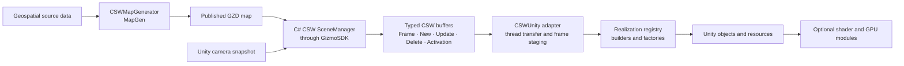

# Streaming Map pipeline design

## Context

CSWUnity realizes streamed CSW presentation data in Unity. It does not generate
maps and does not own source formats.

The responsibilities are divided across three repositories:

| Repository | Responsibility |
| --- | --- |
| [CSW](https://saab.ghe.com/saab/CSW) | CSW architecture and engine-neutral SceneManager implementations |
| [CSWMapGenerator](https://saab.ghe.com/saab/CSWMapGenerator) | Imports geospatial source data and generates, previews, and publishes GZD maps |
| CSWUnity | Consumes C# CSW SceneManager buffers and realizes streamed content in Unity |

GizmoSDK is the shared foundation below CSW. Gizmo3D owns GZD database loading,
the native scene graph, coordinate data, traversal, and dynamic loading.

## End-to-end data flow

## Map generation and publication

CSWMapGenerator provides the CSW World Asset Maker workflow:

1. import and classify source geospatial datasets;
2. configure feature and attribute mappings;
3. select datasets, build extent, coordinate system, and output settings;
4. build the map with SceneBuilder workers;
5. preview the generated map in MapEditor; and
6. publish the GZD map to a location accessible through a supported URL.

Map generation remains outside the CSWUnity runtime boundary.

## Runtime loading

1. The host configures one or more map source URLs in CSWUnity.
2. CSWUnity submits correlated map commands to the C# CSW SceneManager.
3. CSW SceneManager asks GizmoSDK to resolve the source, inspect its header,
   validate coordinates, and establish ROI/dynamic loaders.
4. CSW SceneManager uses camera and refresh commands to update traversal,
   culling, LOD, and streaming.
5. CSW SceneManager emits typed frame and structural buffers.
6. The CSWUnity receiver transfers those buffers without invoking Unity APIs.
7. The Unity main thread stages and commits changes through registered
   realizers.
8. Resource services allocate, share, update, and recycle Unity resources.
9. Optional feature modules decorate or render the committed scene.

## Source-format boundary

GZD is required for the first production version. Future streamed formats are
integrated below the common CSW scene protocol.

CSWUnity may consume optional format metadata, but core lifecycle, frame
ordering, identities, and common realizers shall not depend on GZD classes.

## Coordinate flow

CSW SceneManager publishes coordinate system and origin information. CSWUnity
retains source positions at the precision supplied by CSW/GizmoSDK and applies
the configured axis, unit, and local-origin transformation when producing
Unity transforms.

Camera data travels in the opposite direction: CSWUnity snapshots the active
Unity camera, converts it into the CSW coordinate contract, and submits it
before requesting a refresh.

## Ownership boundaries

| Concern | Owner |
| --- | --- |
| Source datasets and build settings | CSWMapGenerator |
| GZD generation and publication | CSWMapGenerator |
| Source-format reading and native scene | GizmoSDK |
| Map lifecycle, traversal, dynamic loading, and scene buffers | C# CSW SceneManager |
| Thread transfer and frame application | CSWUnity |
| Unity-object conversion | CSWUnity realizers |
| Unity resource lifetime | CSWUnity resource services |
| Optional shaders and GPU features | CSWUnity feature modules |
| Product behavior and presentation choices | Host project |

## Compatibility

A release validates a complete pipeline:

- CSWMapGenerator version producing the GZD map;
- GizmoSDK version reading and streaming it;
- C# CSW SceneManager command-contract version;
- CSWUnity package version; and
- Unity and render-pipeline version.

## Related documentation

- [Streaming Map input requirements](../requirements/streaming-map-input.md)
- [Next-generation architecture](next-generation-architecture.md)
- [Load a MapGen GZD map](../howto/load-mapgen-map.md)
