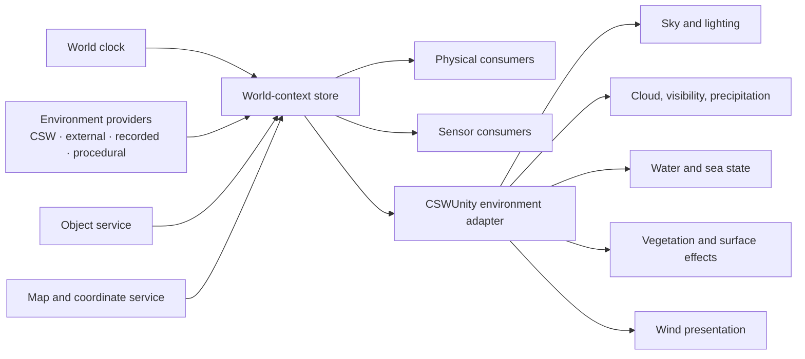

# Synthetic world architecture

**Status:** Proposed target architecture

## Context

CSW defines a broad synthetic-world capability scope that includes maps,
simulation time, world objects, weather, wind, atmosphere, lighting, water,
vegetation, and sensor presentation.

The current CSW implementation does not yet provide a complete typed contract
for every capability:

- controlled simulation time is implemented;
- gravity and a global wind vector exist in simulation world state;
- atmospheric calculations exist inside some physical models;
- map-based ground queries are implemented;
- PBR materials and streamed terrain are implemented;
- weather, clouds, precipitation, visibility, water state, time-of-day
  lighting, and realistic sensor effects are primarily capability scope rather
  than complete shared APIs.

CSWUnity therefore needs an extensible architecture and explicit maturity
reporting rather than one monolithic weather implementation.

## Design principles

1. CSW owns portable world semantics.
2. Providers own authoritative data and update cadence.
3. CSWUnity caches and presents approved world state.
4. Unity feature modules own render-pipeline-specific realization.
5. Simulation, sensors, and presentation may derive different outputs from the
   same source snapshot.
6. Missing capability data is explicit.
7. Visual approximations are not authoritative simulation state.

## Architecture

## World context

The world context binds all state that must remain coherent:

- world/session identity;
- world and simulation clock;
- coordinate-system descriptor;
- Map Origin `GeoPosition`;
- Local 3D Frame identity and generation;
- environment revision;
- active map-source identities; and
- object-store revision.

A consumer receives the context with every snapshot or can resolve it by a
stable context identity. A value from one context cannot be applied silently
to another.

## Time model

The architecture distinguishes:

- **source time:** when a provider measured or authored a value;
- **simulation time:** controlled scenario time;
- **UTC time:** absolute time where available;
- **receive time:** when the local process received an update; and
- **presentation time:** the interpolated time rendered by Unity.

The world clock defines pause, step, scale, replay, and external-follow
behavior. Unity frame time controls presentation scheduling but does not
replace semantic world time.

## Environment state

An environment snapshot is immutable and versioned. It contains a common
header and optional typed sections.

### Common header

- world/context identity;
- provider and authority;
- source, simulation, and receive time;
- coordinate frame;
- spatial region or sample position;
- altitude range;
- validity interval;
- quality and uncertainty; and
- schema version.

### Typed sections

| Section | Initial semantics | Extension examples |
| --- | --- | --- |
| Gravity | vector or magnitude and frame | spatial gravity model |
| Wind | vector and frame | altitude layers, fields, gusts, turbulence |
| Atmosphere | temperature, pressure, density, humidity | composition and derived values |
| Visibility | range or extinction | wavelength-dependent attenuation |
| Precipitation | type, intensity, direction/fall velocity | accumulation and particle distribution |
| Cloud and sky | coverage and layers | volumetric fields and optical properties |
| Lighting | sun/moon direction and intensity, ambient state | celestial and spectral models |
| Water | level and optional current/wave state | sea spectrum and shoreline state |
| Surface | material and condition | wetness, snow, dust, vegetation state |

No section is mandatory for all deployments. Consumers declare required and
optional fields.

## Provider model

An environment provider may be:

- a CSW simulation component;
- an external object/distribution adapter;
- a recorded scenario;
- a procedural model;
- a static configuration asset; or
- a composite of several providers with explicit authority.

Providers publish immutable snapshots or respond to position/time sampling
requests. Provider arbitration occurs before Unity realization.

## Spatial models

The initial global wind vector remains representable, but the contract supports
increasing spatial detail:

1. world-wide constant;
2. region or layer;
3. sampled field;
4. time-varying volume; and
5. provider-specific extension.

Consumers request only the level they support. A coarse provider can satisfy a
fine-grained request with declared quality and coverage.

## Unity realization

The environment adapter publishes committed snapshots to optional feature
modules. Each module declares:

- required and optional state fields;
- supported render pipelines and platforms;
- shader, compute, asset, and hardware dependencies;
- update cadence and interpolation policy;
- CPU, GPU, and memory budget; and
- fallback behavior.

Examples include sky/lighting, fog/visibility, cloud, precipitation, wind
visualization, water, vegetation, and sensor effects.

The core package does not require any particular module.

## Physics and sensor consumers

Physical and sensor models consume the semantic snapshot directly or through a
domain service. They do not sample visual Unity effects to recover world state.

For example:

- vehicle aerodynamics consume wind and atmospheric density;
- a visual wind module animates foliage from the same wind sample;
- a camera sensor consumes visibility and lighting assumptions;
- a visual fog module consumes the same visibility state through a
  render-pipeline adapter.

## Capability maturity

Each capability records:

- contract version;
- providers;
- Unity realizers;
- supported platforms/render pipelines;
- validation profile;
- current maturity level; and
- known semantic gaps.

This prevents the CSW capability vision from being mistaken for an already
implemented and validated CSWUnity feature.

## Failure and degradation

- Missing optional state uses a declared module fallback.
- Missing required state disables the dependent module and reports why.
- Stale state follows the provider or feature expiry policy.
- Conflicting authority is rejected or resolved before publication.
- Unsupported hardware disables only the affected realization.
- Core map and object streaming continues when optional environment rendering
  is unavailable.

## Related documentation

- [Synthetic world requirements](../requirements/synthetic-world.md)
- [External object integration](object-integration.md)
- [Rendering architecture](rendering.md)
