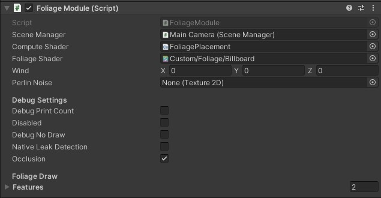
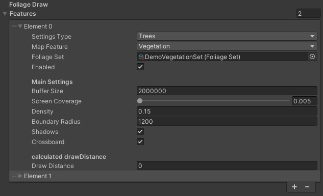
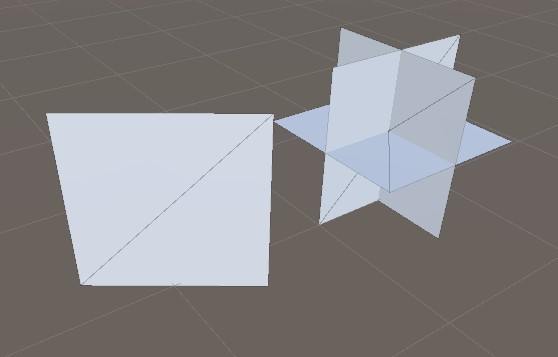
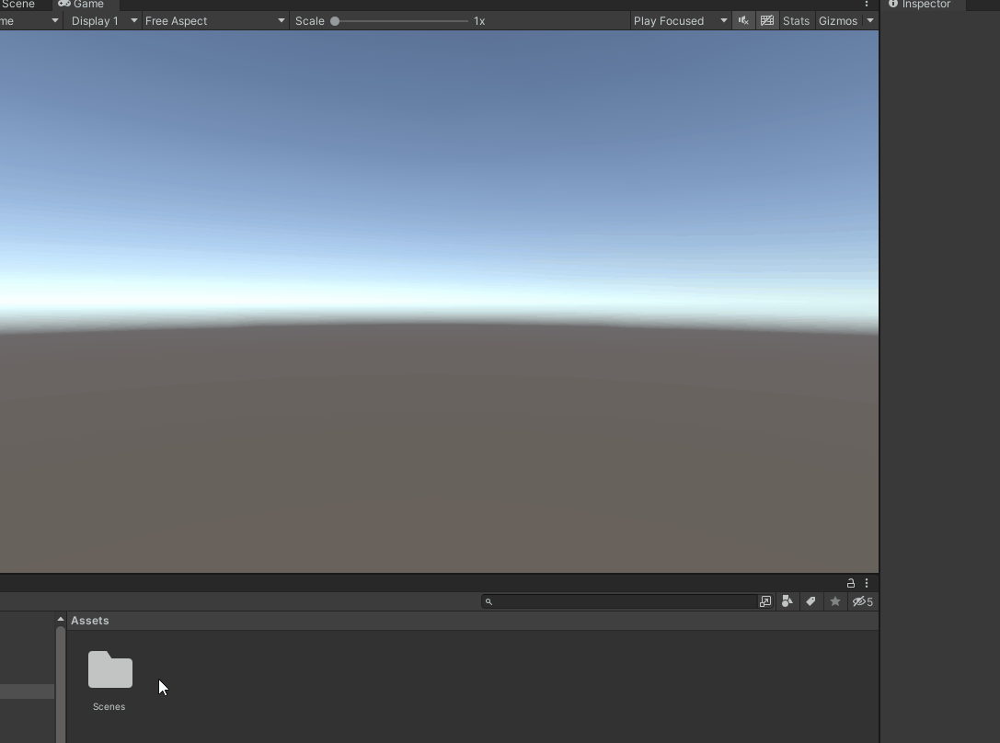
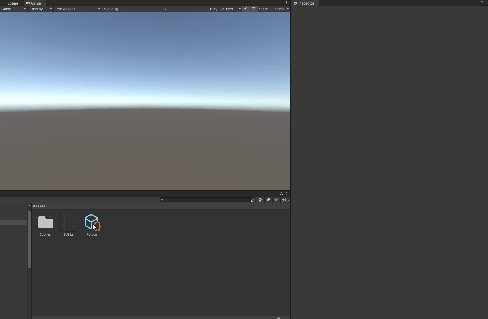
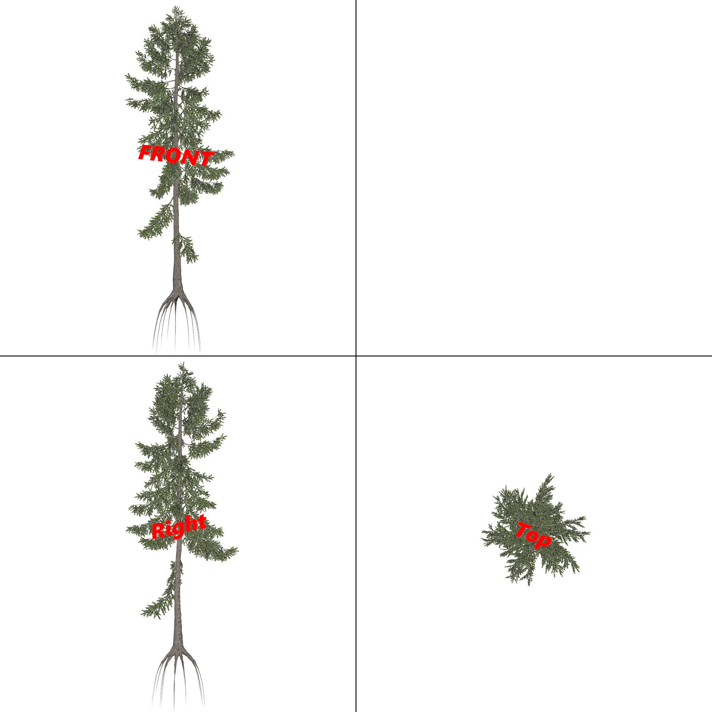
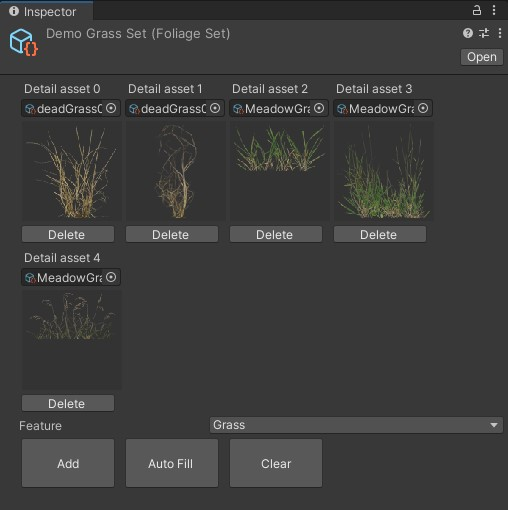

<b>Foliage Module</b>
==================

<b>Introduction</b>

Foliage module handles the placement of foliage in our streaming maps, which it does through the use of the feature/height data found in our maps. It also handles the foliage interactions with the world, currently just the Wind. 

<b>Usage</b>

The foliage module takes in some basic settings like which camera it should render to and which shaders to use, but most importantly it controls which foliage should be drawn where and when.
This behavior is defined by features.

<b>Features</b>

A feature associates a [foliage set](#foliageSet) with information about how its members should be distributed and rendered. The distribution is controlled by the map feature setting which defines where the members of the foliage set are allowed to be placed, as well as their density and boundary radius.

The distribution settings you can define are: 
-
- **Density**
    - defines how closely the foliage assets are placed in the world.
- **Boundary Radius**
    - defines the maximum size of the map node (in meters) that the feature should be rendered at. You can think of this as a kind of LOD system. 

<b>Note</b>
-   The distribution can also be affected by the individual settings of foliage asset in your foliage set. Like for example its valid height range which would stop it from being place if the heightdata does not return a value inside that range.  

The rendering settings you can define are:
-

- **Buffer size**
    - Defines the maximum amount of foliage assets that can be rendered each frame (in the current feature), lower is better but too small will cause problems (even hard crashes). The amount you set here should be based on how much you want to render (foliage density and draw distance).    
- **Screen coverage** (threshold for removing things which only covers a very small part of the screen)
    - The draw distance is not defined as a range but rather based on how many percent of the screen the largest foliage asset in the feature covers. This allows the level of detail to automatically increase when zooming in.
- **Shadows**
    - this is pretty self explanatory, on or off.
- **Crossboards**
    - Defines whether the feature set will render the foliage assets as a crossboard (three faces: front, right, top) or as a billboard (one face, always facing the camera). Crossboards are better for bigger objects, like trees and bushes, but might be "overkill" for grass.

_[Left billboard, right crossboard]_

<b>Warning!</b>
-

- The current implementation of billboards actually creates a random cluster of 8 billboards in a 1x1 meter area. (when density is 1)

Foliage
==================

<b>Create</b>

To create a foliage asset you simply right click in the directory you want your asset to be created and select "Create -> Terrain -> Foliage" and give it a name.

<b>Configure</b>

When configuring a new tree the most important settings is the main texture, min/max height, ground offset and weight. Everything else is either not used, or used simply for sorting and/or previewing.

The height settings define the accepted interval of the foliage asset, this is used to give the foliage a height variation but it is also used for placement validation. For example, when placing a tree in a forest, if the height data says that the height there is just 2 meters it would be odd to draw an old oak thats just 2 meters tall, but a young spruce might be okay.

Ground offset is used when the images you want to use for your foliage is misaligned with the ground and needs to be offset. The red line in the preview symbolizes the ground.

The mode option changes how the preview interprets the image.
- If your image is made to be used with a billboard, select "Single".
- If it is made to be used with a crossboard, select "Atlas".
This only affects the preview, and not how the asset is actually rendered in the world.

The weight defines how common the foliage is.
This value is used to determine how dominant a type of foliage is in relation to others in the same set.
Using this dominance-value, the appropriate amount of assets can then be placed in the world.

<b>Note</b>
-
- In a future update the weight will be moved to the feature set instead.

<b id="foliageSet">Foliage Set</b>

A foliage set is a collection of foliage assets. It's created in the same manner as a foliage asset. You can see it as the palette for the feature. You should avoid mixing foliage with too different sizes as it could lead to a lot of unnecessary foliage being rendered. Using both crossboards and billboards in the same set is also a bad idea.

