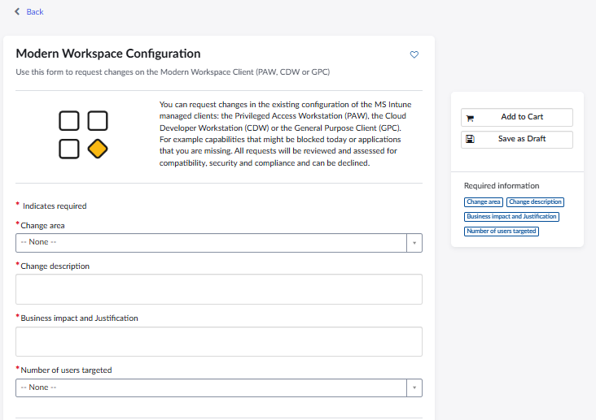

# 1\. CDW Installation and System Requirements

This section describes the Cloud Development Workstation (CDW) setup and the hardware/system requirements needed to run the **CSWUnity Map Streamer** demo.

## 1.1 Work Zone

**Work Zone:** CDW (Cloud Development Workstation) — Not Export Controlled.

Refer to the CDW onboarding guide:

`https://saab-frontrunner-onboarding-guide.pages.saab.ghe.com/generic-onboarding/cdw-setup/`

Follow the required onboarding steps up to Step 6.

## 1.2 Request a New CDW

Raise a request for a default CDW configuration using:

`https://servicehub.saabgroup.com/esc?id=sc\_cat\_item\&sys\_id=029ce8e41d4c22507d0b1c3769ce7078\&table=sc\_cat\_item\&searchTerm=cdw`

While raising the request:

* Select **CDW Non-Export Control**.
* Select the respective line-manager name for approval.
* Add the request to the cart.
* Proceed to submit the request from the cart view.

After approval, the IT Service Desk initially provides a default configured CDW with approximately:

* **4 vCPU**
* **16 GB RAM**
* **128 GB storage**

## 1.3 Request a GPU-Enabled CDW

A GPU-enabled CDW is recommended for the CSWUnity Map Streamer demo.

Raise the request using:

`https://servicehub.saabgroup.com/esc?id=sc\_cat\_item\&sys\_id=5408c2fbafbf62100f26a2c6512749bc`

*Figure: Modern Workspace Configuration page used to request a GPU-enabled CDW.*

Use the following information in the request:

* **Change Area:** Cloud Developer Workstation (CDW)
* **Change Description:** Request for “GPU-Enabled CDW” (New/Replace Existing CDW with GPU-Enabled CDW)

Suggested technical justification:

> Add a Graphics Processing Unit (GPU) with at least 4 GB to meet CSW project tasks and Gizmo workloads using Unity and Unreal. GPU support is required for graphical workloads.

Suggested business justification:

> Need GPU in CDW, as the CommonTech project requires graphical processing using Unity.

> \*\*Note:\*\* A GPU-enabled CDW does not support Windows Subsystem for Linux (WSL). Currently, the Map Streamer demo has no dependency on WSL.

## 1.4 Hardware Requirements

|Component|Requirement|
|-|-|
|Processor|Intel Core i5 / i7 or equivalent|
|Memory|Minimum 16 GB RAM|
|Storage|Minimum 70–100 GB free disk space|
|Graphics|GPU required|
|Network|Internet access for Git and NuGet packages|

## 1.5 Required Software

|Software|Purpose|
|-|-|
|Git / Git Bash|Clone the CSWUnity repository|
|Visual Studio 2022 Professional / Visual Studio 2026 Enterprise|Build GizmoSDK components|
|.NET Core 3.1 Support|Required for `Install\_Gizmo.sln`|
|Unity Hub|Manage Unity installation and projects|
|Unity Editor|Run the Map Streamer demo|

Recommended versions used for the demo:

|Software / Tool|Version|
|-|-|
|Visual Studio|Professional 2022 (v17.14.40) / Enterprise 2026 (v18.9.2)|
|Git|2.55.0.5|
|Unity Hub|3.20.0|
|Unity Editor|2021.3.17f1 for the T&S BTA reference architecture; 6000.3.21f1 LTS may be preferred for new projects|

The T&S BTA Map Streamer architecture in this repository is pinned to Unity
`2021.3.17f1`. Other Saab projects can have different Unity-version
requirements and should follow their own `ProjectSettings/ProjectVersion.txt`
file and approved dependency set.

New projects may prefer Unity `6000.3.21f1 LTS`, provided compatibility with
the required CSWUnity, GizmoSDK, rendering, and package dependencies has been
verified. Do not upgrade an existing project solely on the basis of this guide.
