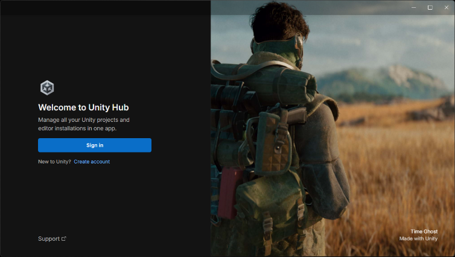
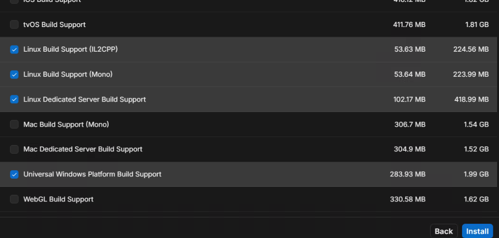
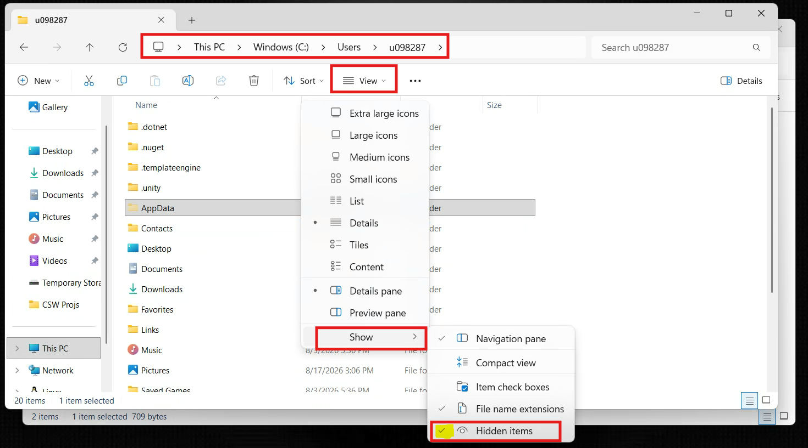
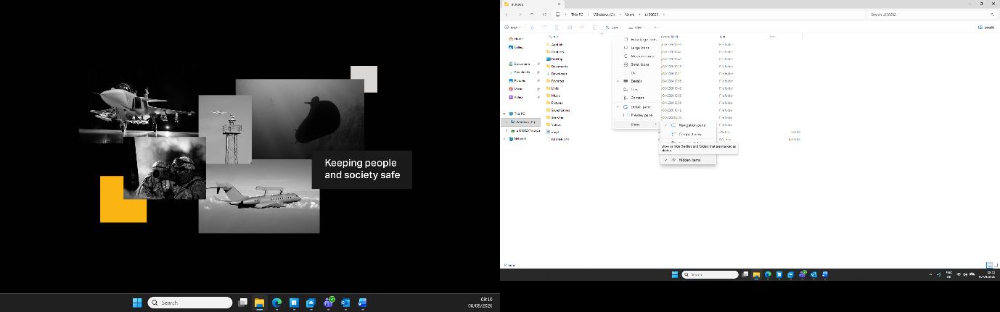
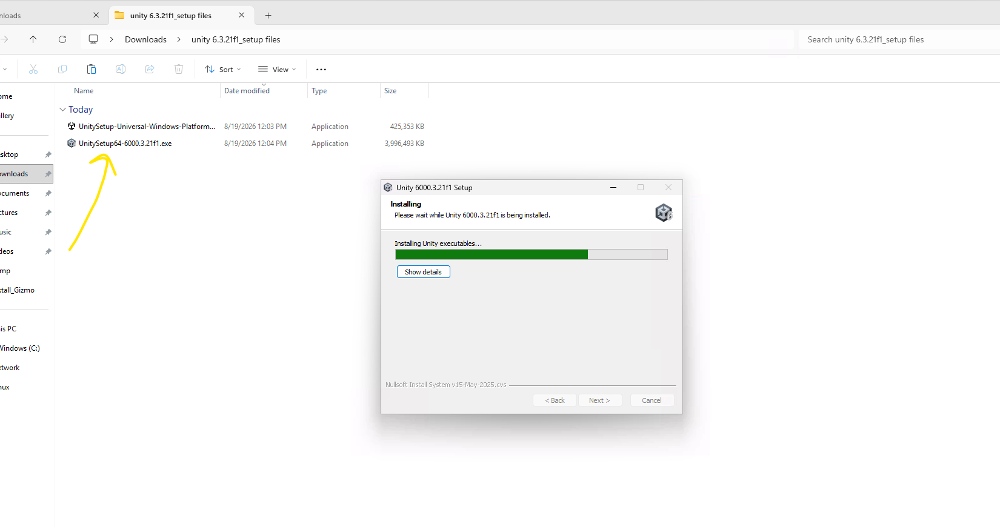
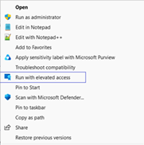
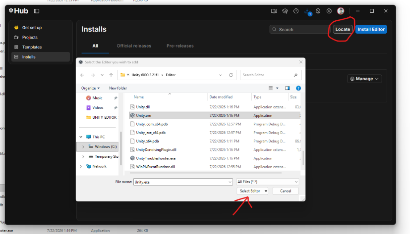

# 3. Unity Installation

Unity Hub and Unity Editor are required to open and run the **CSWUnity Map Streamer** demo.

## 3.1 Install Unity Hub

Unity Hub can be installed through the Visual Studio installation process or separately.

Unity Hub installation reference:

`https://docs.unity.com/en-us/hub/install-hub-win-mac`

After installation:

1. Open **Unity Hub**.
2. Sign in using an existing Unity account or create a new account.
3. Complete any required verification steps, such as:
   - Verification code
   - Security approval
   - Two-factor authentication

After successful login, the account information should appear in the top-right area of Unity Hub.

*Figure: Unity Hub welcome/sign-in screen.*

## 3.2 Install Unity Editor

The T&S BTA Map Streamer architecture in this repository uses:

`Unity 2021.3.17f1`

This version is recorded in
`projects/com.saab.map-streamer/ProjectSettings/ProjectVersion.txt` and should
be used when opening the existing demo project.

Different Saab projects can have different Unity-version requirements. Always
follow the target project's `ProjectSettings/ProjectVersion.txt` file and
approved dependency set. For a new project, Unity `6000.3.21f1 LTS` may be
preferred after compatibility with the required CSWUnity, GizmoSDK, rendering,
and package dependencies has been verified.

Select the required Unity build modules depending on the target platform.

*Figure: Example Unity build modules available during Unity Editor installation.*

## 3.3 CDW Installation Limitation

On CDW, software may not be allowed to automatically install other downloaded software packages.

Unity Hub downloads can normally be found under:

`C:/Users/UserProfile-ID/AppData/Roaming/UnityHub/downloads`

The `AppData` folder is hidden by default.

To show it:

1. Open the user profile folder.
2. Click **View**.
3. Select **Show**.
4. Enable **Hidden Items**.

*Figure: Enable Hidden Items in File Explorer to access the AppData folder.*

*Figure: Example Unity installation packages downloaded by Unity Hub.*

## 3.4 Install Unity Editor and Modules Manually

Install the main Unity Editor executable first:

`UnitySetup<x.y.z>.exe`

*Figure: Unity Editor installation in progress.*

Then install the required Unity modules.

For each package:

1. Right-click the package.
2. Select **Show more options**.
3. Select **Run with elevated access**.

*Figure: Run the downloaded Unity installer/module with elevated access on CDW.*

4. Complete the installation.

> **Important:** Install `UnitySetup<x.y.z>.exe` first. Otherwise, the Unity modules may not detect the Unity Editor installation directory correctly.

## 3.5 Add Unity Editor to Unity Hub

1. Open **Unity Hub**.
2. Select **Installs**.
3. Click **Locate**.
4. Select the installed Unity Editor executable.

Example for the T&S BTA project when installed through Unity Hub:

`C:/Program Files/Unity/Hub/Editor/2021.3.17f1/Editor/Unity.exe`

*Figure: Use the Locate option in Unity Hub and select the installed Unity Editor.*

The steps for opening and running the Map Streamer project are described in
the [Map Streamer demo guide](CDW_map_streamer_DEMO.md).
