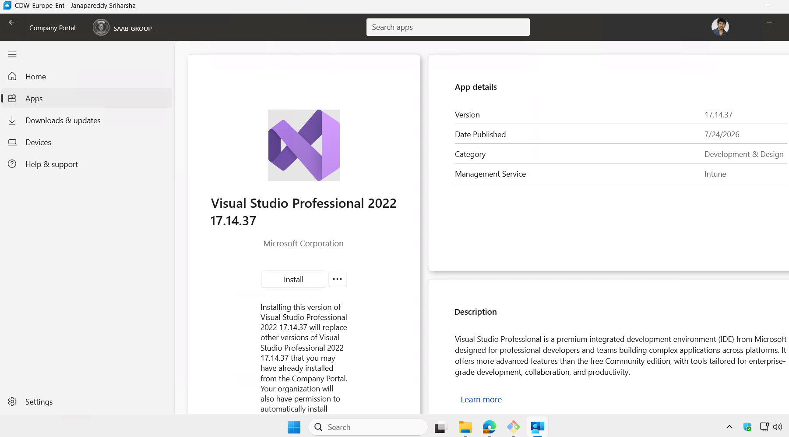
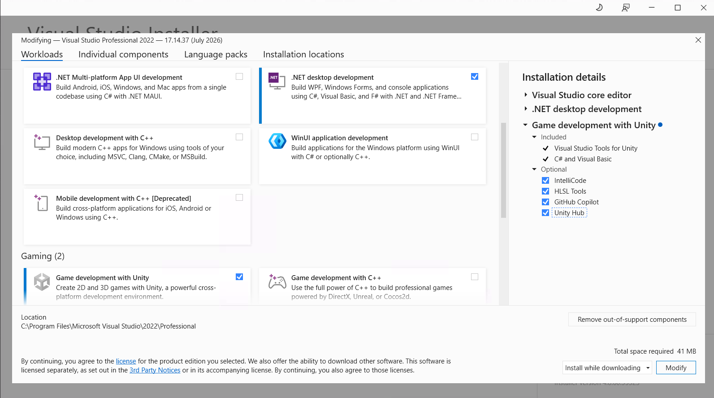
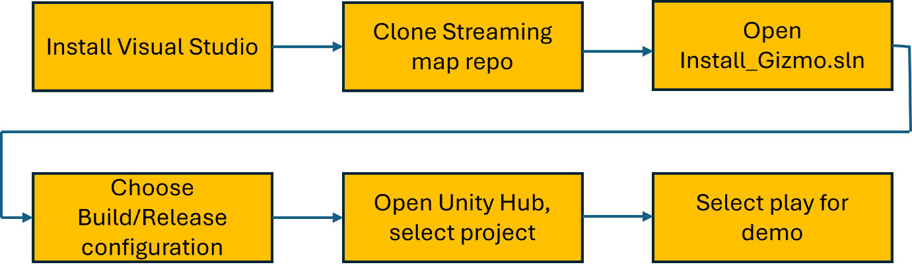
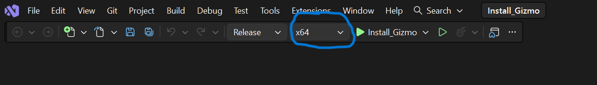
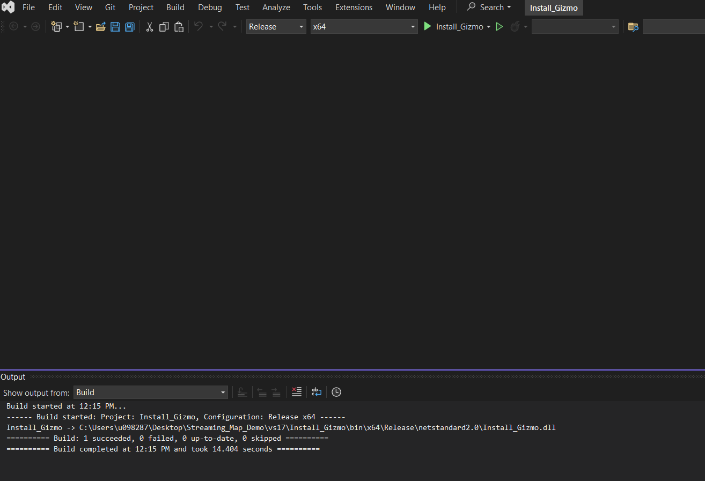
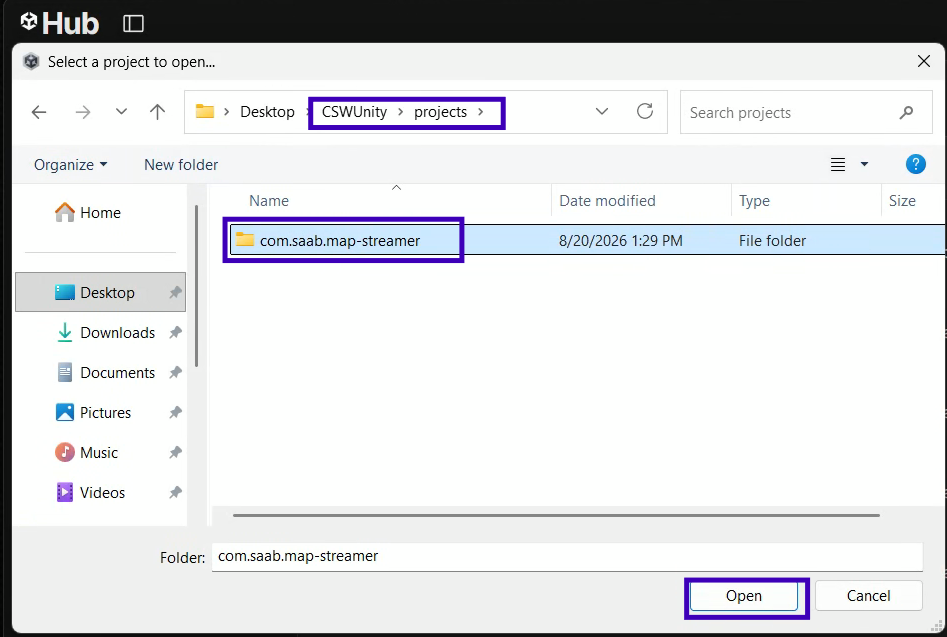
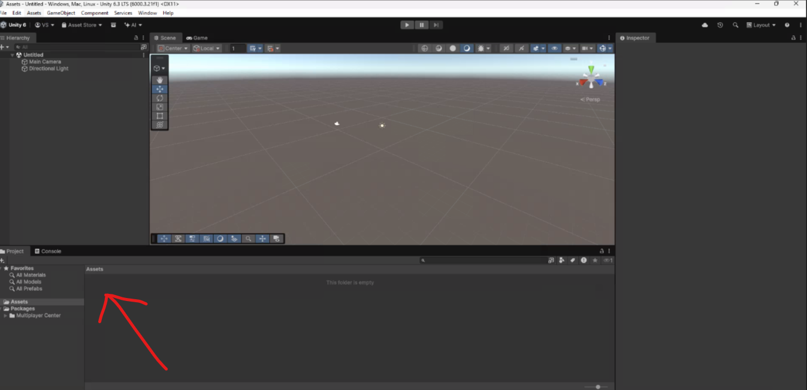
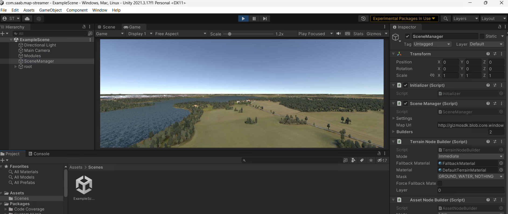

# map-streamer DEMO Guide

This guide combines the complete setup and execution workflow for the **CSWUnity Map Streamer Demo**.

> **Image path note:** Keep this file inside `tutorial/howto/` together with `CDW_IMAGES`, `VISUAL_STUDIO_IMAGES`, `UNITY_IMAGES`, and `MAP_STREAMER_IMAGES`.

## 1. CDW Installation and System Requirements

This section describes the Cloud Development Workstation (CDW) setup and the hardware/system requirements needed to run the **CSWUnity Map Streamer** demo.

### 1.1 Work Zone

**Work Zone:** CDW (Cloud Development Workstation) — Not Export Controlled.

Refer to the CDW onboarding guide:

`https://saab-frontrunner-onboarding-guide.pages.saab.ghe.com/generic-onboarding/cdw-setup/`

Follow the required onboarding steps up to Step 6.

### 1.2 Request a New CDW

Raise a request for a default CDW configuration using:

`https://servicehub.saabgroup.com/esc?id=sc_cat_item&sys_id=029ce8e41d4c22507d0b1c3769ce7078&table=sc_cat_item&searchTerm=cdw`

While raising the request:

- Select **CDW Non-Export Control**.
- Select the respective line-manager name for approval.
- Add the request to the cart.
- Proceed to submit the request from the cart view.

After approval, the IT Service Desk initially provides a default configured CDW with approximately:

- **4 vCPU**
- **16 GB RAM**
- **128 GB storage**

### 1.3 Request a GPU-Enabled CDW

A GPU-enabled CDW is recommended for the CSWUnity Map Streamer demo.

Raise the request using:

`https://servicehub.saabgroup.com/esc?id=sc_cat_item&sys_id=5408c2fbafbf62100f26a2c6512749bc`

*Figure: Modern Workspace Configuration page used to request a GPU-enabled CDW.*

Use the following information in the request:

- **Change Area:** Cloud Developer Workstation (CDW)
- **Change Description:** Request for “GPU-Enabled CDW” (New/Replace Existing CDW with GPU-Enabled CDW)

Suggested technical justification:

> Add a Graphics Processing Unit (GPU) with at least 4 GB to meet CSW project tasks and Gizmo workloads using Unity and Unreal. GPU support is required for graphical workloads.

Suggested business justification:

> Need GPU in CDW, as the CommonTech project requires graphical processing using Unity.

> **Note:** A GPU-enabled CDW does not support Windows Subsystem for Linux (WSL). Currently, the Map Streamer demo has no dependency on WSL.

### 1.4 Hardware Requirements

| Component | Requirement |
|---|---|
| Processor | Intel Core i5 / i7 or equivalent |
| Memory | Minimum 16 GB RAM |
| Storage | Minimum 70–100 GB free disk space |
| Graphics | GPU required |
| Network | Internet access for Git and NuGet packages |

### 1.5 Required Software

| Software | Purpose |
|---|---|
| Git / Git Bash | Clone the CSWUnity repository |
| Visual Studio 2022 Professional / Visual Studio 2026 Enterprise | Build GizmoSDK components |
| .NET Core 3.1 Support | Required for `Install_Gizmo.sln` |
| Unity Hub | Manage Unity installation and projects |
| Unity Editor | Run the Map Streamer demo |

Recommended versions used for the demo:

| Software / Tool | Version |
|---|---|
| Visual Studio | Professional 2022 (v17.14.40) / Enterprise 2026 (v18.9.2) |
| Git | 2.55.0.5 |
| Unity Hub | 3.20.0 |
| Unity Editor | 6000.3.21f1 (LTS) |

Latest supported versions may be used where applicable.

---

## 2. Visual Studio Installation

Visual Studio is required to build the GizmoSDK components and generate the plugin DLLs used by the Unity Map Streamer demo.

### 2.1 Install Visual Studio

1. Open the **Company Portal** application in the CDW.
2. Search for and install one of the following:
   - **Visual Studio 2022 Professional**
   - **Visual Studio 2026 Enterprise**
3. After installation is complete, restart the CDW.

*Figure: Visual Studio Professional available through the Company Portal.*

### 2.2 Install Required Workloads

1. Open **Visual Studio Installer** from the Windows Start menu.
2. Find the installed Visual Studio version.
3. Click **Modify**.
4. Keep the default selected workloads.
5. Additionally select:
   - `.NET desktop development`
   - `Game development with Unity`
6. Under **Installation Details**, select **Unity Hub** if available.
7. Click **Modify**.

*Figure: Required Visual Studio workloads and Unity-related installation options.*

This installs the dependencies required to build the GizmoSDK solution and work with Unity.

### 2.3 First-Time Visual Studio Login

1. Open Visual Studio.
2. Sign in using a Microsoft or GitHub account if required.
3. Complete any authentication steps.

### 2.4 Solution Used for the Map Streamer Build

After cloning the CSWUnity repository, the solution used for the GizmoSDK build is:

`CSWUnity/vs17/Install_Gizmo/Install_Gizmo.sln`

The complete clone and build process is described in `04_map_streamer.md`.

---

## 3. Unity Installation

Unity Hub and Unity Editor are required to open and run the **CSWUnity Map Streamer** demo.

### 3.1 Install Unity Hub

Unity Hub can be installed through the Visual Studio installation process or separately.

Unity Hub installation reference:

`https://docs.unity.com/en-us/hub/install-hub-win-mac`

After installation:

1. Open **Unity Hub**.
2. Sign in using an existing Unity account or create a new account.
3. Complete any required verification steps, such as:
   - Verification code
   - Security approval
   - Two-factor authentication

After successful login, the account information should appear in the top-right area of Unity Hub.

*Figure: Unity Hub welcome/sign-in screen.*

### 3.2 Install Unity Editor

The Map Streamer demo originally used Unity `2021.3.17f1`, but the recommended version for the current setup is:

`Unity 6000.3.21f1 LTS`

or the latest supported LTS version.

Select the required Unity build modules depending on the target platform.

*Figure: Example Unity build modules available during Unity Editor installation.*

### 3.3 CDW Installation Limitation

On CDW, software may not be allowed to automatically install other downloaded software packages.

Unity Hub downloads can normally be found under:

`C:/Users/UserProfile-ID/AppData/Roaming/UnityHub/downloads`

The `AppData` folder is hidden by default.

To show it:

1. Open the user profile folder.
2. Click **View**.
3. Select **Show**.
4. Enable **Hidden Items**.

*Figure: Enable Hidden Items in File Explorer to access the AppData folder.*

*Figure: Example Unity installation packages downloaded by Unity Hub.*

### 3.4 Install Unity Editor and Modules Manually

Install the main Unity Editor executable first:

`UnitySetup<x.y.z>.exe`

*Figure: Unity Editor installation in progress.*

Then install the required Unity modules.

For each package:

1. Right-click the package.
2. Select **Show more options**.
3. Select **Run with elevated access**.

*Figure: Run the downloaded Unity installer/module with elevated access on CDW.*

4. Complete the installation.

> **Important:** Install `UnitySetup<x.y.z>.exe` first. Otherwise, the Unity modules may not detect the Unity Editor installation directory correctly.

### 3.5 Add Unity Editor to Unity Hub

1. Open **Unity Hub**.
2. Select **Installs**.
3. Click **Locate**.
4. Select the installed Unity Editor executable.

Example:

`C:/Program Files/Unity 6000.3.21f1/Editor/Unity.exe`

*Figure: Use the Locate option in Unity Hub and select the installed Unity Editor.*

The steps for opening and running the Map Streamer project are described in `04_map_streamer.md`.

---

## 4. Map Streamer

This section describes the complete workflow for setting up and running the **CSWUnity Map Streamer** demo after CDW, Visual Studio, and Unity are installed.

*Figure: Overall Map Streamer workflow from installation and cloning through build and Unity demo execution.*

### 4.1 Install Git

1. Open the **Company Portal** application in the CDW.
2. Search for and install **Git**.
3. This installs:
   - Git Bash
   - Git CMD

### 4.2 Clone the CSWUnity Repository

1. Open a browser and go to:

   `https://saab.ghe.com`

2. Authenticate using Saab SSO.

3. Open **Git Bash**.

4. Navigate to the directory where you want to clone the repository.

5. Run:

`git clone https://saab.ghe.com/saab/CSWUnity.git`

6. Navigate into the repository:

`cd CSWUnity`

The repository contains files/folders similar to:

    CSWUnity
    │
    ├── Build_x64.bat
    ├── Build_x64_d.bat
    ├── README.md
    ├── projects
    ├── tutorial
    ├── vs17
    ├── com.saab.map-streamer
    └── Saab.Foundation.Map.Manager.Test

### 4.3 Open the Repository in File Explorer

From Git Bash, open the current repository folder in Windows File Explorer:

`explorer .`

Alternatively, navigate manually to the cloned `CSWUnity` folder.

### 4.4 Open the GizmoSDK Solution

In File Explorer, navigate to:

`CSWUnity/vs17/Install_Gizmo/`

Open:

`Install_Gizmo.sln`

The solution opens in Visual Studio.

### 4.5 Build the GizmoSDK Components

Building the solution:

- Downloads the required NuGet packages.
- Builds the required libraries.
- Generates plugin DLLs.
- Deploys the plugin binaries required by Unity.

The available build configurations are:

    Debug | x64
    Release | x64

Recommended usage:

- **Release | x64** — Recommended for running the demo.
- **Debug | x64** — Recommended for development and debugging.

*Figure: Example Visual Studio build configuration using Release and x64.*

Use only one configuration at a time.

To build the solution in Visual Studio:

`Build -> Build Solution`

or press:

`Ctrl + Shift + B`

*Figure: Example successful build output for the Install_Gizmo solution.*

### 4.6 Switching Between Debug and Release

If changing the build configuration from Debug to Release, or from Release to Debug:

1. Close Unity.
2. Run:

`clean.bat`

3. Reopen `Install_Gizmo.sln`.
4. Select the required configuration.
5. Build the solution again.

> Do not mix Debug and Release plugin DLLs.

### 4.7 Build Using Batch Files

The SDK can also be built using the batch files available in the CSWUnity repository.

For a Release build:

`build_x64.bat`

For a Debug build:

`build_x64_d.bat`

Before switching between build configurations, run:

`clean.bat`

### 4.8 Add the Map Streamer Project to Unity Hub

1. Open **Unity Hub**.
2. Select **Projects**.
3. Click **Add Project From Disk**.
4. Select:

`CSWUnity/projects/com.saab.map-streamer`

*Figure: Select the com.saab.map-streamer project folder when adding the project in Unity Hub.*

> Ensure that the correct Unity project folder is selected.

*Figure: Example of an incorrectly selected project directory resulting in missing Assets.*

### 4.9 Open the Project in Unity

1. In Unity Hub, click the `com.saab.map-streamer` project.
2. Wait for Unity Editor to finish:
   - Importing assets
   - Compiling scripts
   - Resolving packages

3. In the Unity Project window, open:

`Assets -> Scenes -> Example Scene`

4. Double-click **Example Scene**.

### 4.10 Run the Demo

Press the **Play (▶)** button at the top of the Unity Editor.

The streaming map should load in the scene.

*Figure: Expected Map Streamer demo output in the Unity Editor.*

### 4.11 Navigation Controls

| Key | Action |
|---|---|
| `W` | Move Forward |
| `A` | Move Left |
| `S` | Move Backward |
| `D` | Move Right |
| `Space` | Move Up |
| `Ctrl` | Move Down |
| `Arrow Keys` | Rotate Camera |
| `Shift` | Increase Movement Speed |

### 4.12 Important Build Note

If the plugin build is changed from **Release to Debug** or from **Debug to Release**:

1. Close Unity.
2. Run `clean.bat`.
3. Rebuild using only the required configuration.
4. Reopen Unity.

This prevents native plugin mismatches and related Unity crashes.
